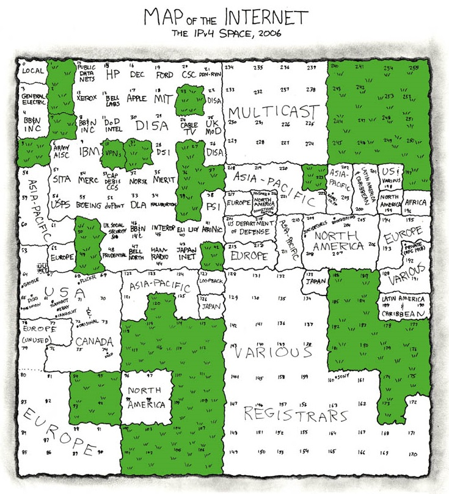
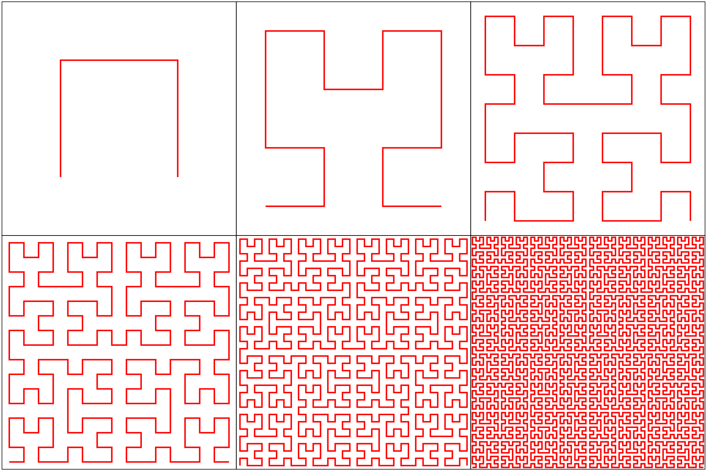
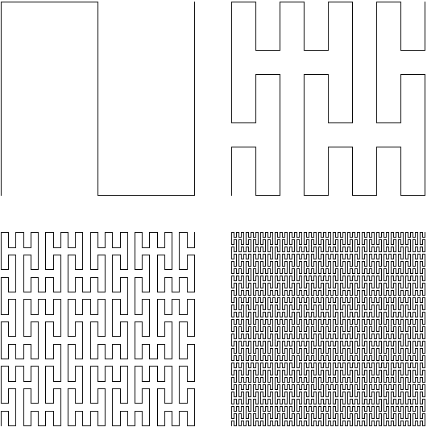
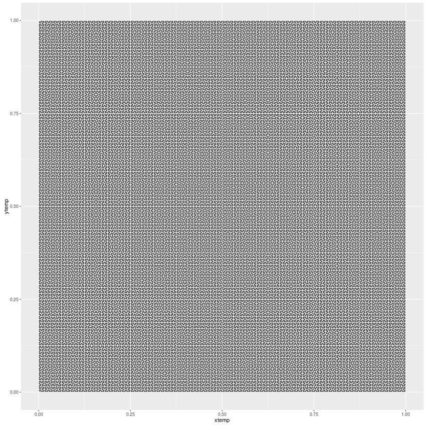
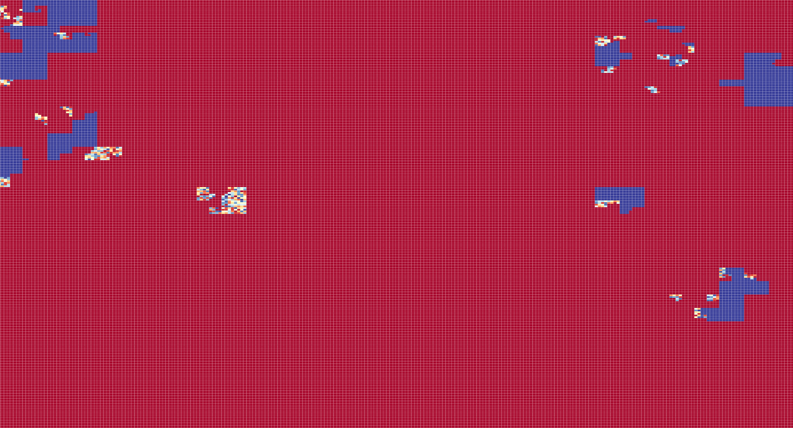
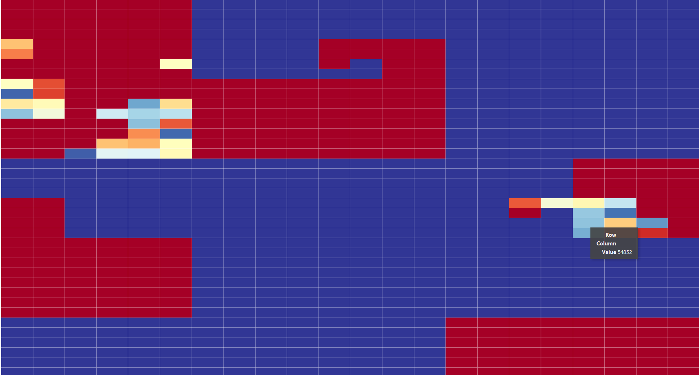
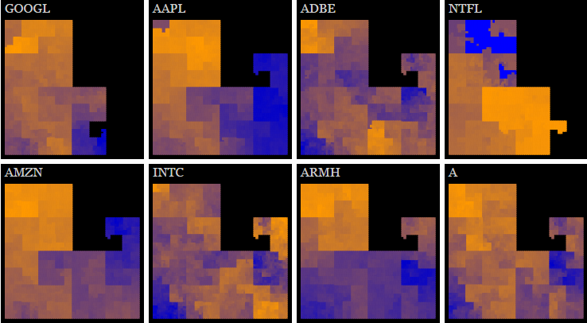
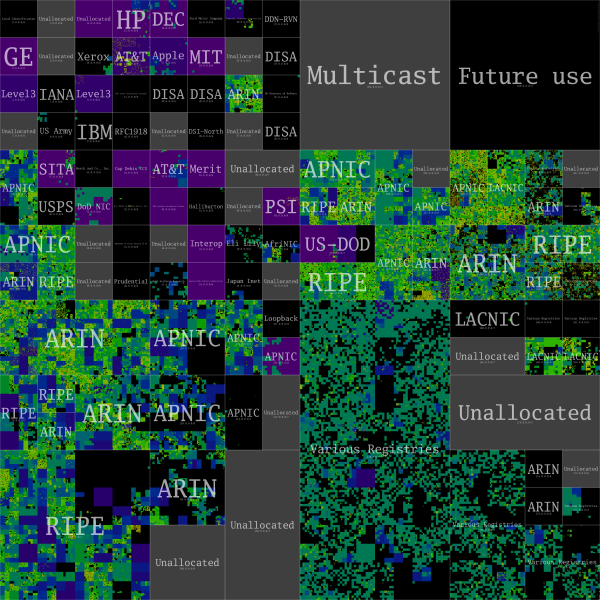

```{r setup, include=FALSE}
knitr::opts_chunk$set(echo = FALSE)
```

## Introduction
<div class="col2">
How do we see into cyberspace?   

How can you look at a list with 4.3 billion entries?


<p></p>
</div>

## Space Filling Curves
<div class="col2">
<p></p>
<p></p>
</div> 
  
  
- Limit of a function that passes through every point in space.  
- Peano, Hilbert, Z-curves, others.  
- All have slightly different properties and generating algorithms, but the same basic principles apply.   

## Neat picture, who cares?
<div class="col2">
<p></p>
<p></p>
</div>

<p></p>

- Preserves locality of points from one dimension into two.  
- Points that are close in one dimension are close in two.  
- Can display very dense information in a compact form.  

## Recursion
<div class="col2">
<p></p>
<p></p>
</div>

* Requires two main components:
    + Terminating condition
    + Code to execute
* Think about deleting a folder with several sub-folders:
    + What is the terminating condition?
    + What is the code being executed?
    
## Hilbert's core
```{r, eval=FALSE, echo=TRUE}
xlist <<- {}
ylist <<- {}
hilbert <- function(x0,y0,xi,xj,yi,yj,n){
    if (n <= 0){
        x <- (x0 +(xi+yi)/2)
        y <- (y0 +(xj+yj)/2)
        xlist <<- c(xlist,x)
        ylist <<- c(ylist,y)
    } else {
        hilbert(x0, y0, yi/2, yj/2, xi/2, xj/2, n-1)
        hilbert(x0+xi/2,y0+xj/2,xi/2,xj/2,yi/2,yj/2,n-1)
        hilbert(x0+xi/2+yi/2,y0+xj/2+yj/2,xi/2,xj/2,yi/2,yj/2,n-1)
        hilbert(x0+xi/2+yi, y0+xj/2+yj,-yi/2,-yj/2,-xi/2,-xj/2,n-1)
    }
}
```
Adapted from Andrew Cumming's - Napier University Edinburgh - psuedo code.

## Breaking it down
* Terminating condition
```{r, eval=FALSE, echo=TRUE}
    if (n <= 0){
    }
```
```{r, eval=FALSE, echo=TRUE}
    hilbert(...,n-1)
```
* Code to execute
```{r, eval=FALSE, echo=TRUE}
        x <- (x0 +(xi+yi)/2)
        y <- (y0 +(xj+yj)/2)
        xlist <<- c(xlist,x)
        ylist <<- c(ylist,y)
```
```{r, eval=FALSE, echo=TRUE}
        hilbert(x0, y0, yi/2, yj/2, xi/2, xj/2, n-1)
        hilbert(x0+xi/2,y0+xj/2,xi/2,xj/2,yi/2,yj/2,n-1)
        hilbert(x0+xi/2+yi/2,y0+xj/2+yj/2,xi/2,xj/2,yi/2,yj/2,n-1)
        hilbert(x0+xi/2+yi, y0+xj/2+yj,-yi/2,-yj/2,-xi/2,-xj/2,n-1)
```

## .... even further
* Recursive functions can be really hard to track.  
* n tells you how many times to divide the 1 dimensional space (x and y unit vectors)
* When the code is executed the hilbert function is repeatedly called until n <= 0 
* Once n <= 0 it calculates the mid point of the space's division and stores it's x and y in the xlist and ylist respectively
* This generates an ordered list of each point on the curve.  

## Hilbert curve (8 iterations)
* Connecting the points in the ordered list yields:
<p></p>

## How to use it
* Requires some helper functions that will take the Hilbert curve's index and map the data of interest to those values.  
* Functions to:
    + Set up ranges
    + Assign values to range
    + Count number of values in range
    + Shade the value of the range based off it's min and max  (heatmap)

* Example data: IP Data 

## Setup the curve index
```{r, eval=T, echo=F}
source("./presentationhacks.R")
library("d3heatmap")
source('./hilbertmaker.R')

```
```{r, eval=F, echo=TRUE}
        clearHilbert()
        hilbert(0,0,1,0,0,1,8)
```
```{r, eval=TRUE, echo=FALSE}
      print(head(xlist))
      print(head(ylist))
```
A peak at the data
```{r, eval=TRUE, echo=FALSE}
      head(ipdata)
```

## Set up ranges
This is how you'll associate data to the curve index
```{r, eval=T, echo=TRUE}
        ipmap <- makeIPmap()
```
```{r, eval=FALSE, echo=TRUE}
makeIPmap <- function () {
    oct1 <- rep(0:255, each = 256)
    oct2 <- rep(0:255, 256)
    ipmap <- data.frame(oct1,oct2)
    #print(head(dat))
    ip <- paste(ipmap$oct1, ipmap$oct2, '0', '0', sep = '.')
    ipmap <- cbind(ipmap,ip)
    nummap <- ip_to_numeric(ip)
    ipmap <- cbind(ipmap, nummap)
    return(ipmap)
}        
```
```{r, eval=T, echo=T}
        head(ipmap)
```

## Count IP values in range
```{r, eval=F, echo=T}
countip <- function(dat) {
    output <- data.frame(rownumber = numeric(0), interval = numeric(0), count = numeric(0))
    #print(str(output))
    for(rownum in 1:nrow(dat)) {
        if(dat[rownum,"iprange"] == 0){
            intervals <- findInterval(dat[rownum,"ipnumeric"], ipmap$nummap)
            counts <- 1
            output <- rbind(output,cbind(rownum, intervals, counts))
            #print(output)
            #cat("***SINGLE",rownum,"***\n")
        } else {
            #print(dat)
            #cat("+++INTERVAL",rownum,"+++\n")
            output.new <- ipwrange(dat,rownum)
            output <- rbind(output,output.new)
        }
    }
    return(output)
}
```

* In this case the if statement never evaluates as false.  The data originally included the start and ending IPs for a range.
* This sample data doesn't include ranges so everything will evaluate as a single IP. 

## Aggregate the counts
Take the counts of IPs and sum them for each interval
```{r, eval=F, echo=T}
countfinal <- aggregate(countwip['counts'], by = countwip['intervals'],sum)
```

## Add the interval number to the IP map and join
```{r, eval=F, echo=T}
ipmap$intervals <- 1:65536
```

```{r, eval=T, echo=T}
head(ipmap)
```
```{r, eval=F, echo=T}
datafinal <- left_join(ipmap,countfinal, by = "intervals")
```
```{r, eval=T, echo=T}
head(datafinal)
```


## Final steps
```{r, eval=F, echo=T}
makeheatmap <- function(dat){
    dataheatmap <- acast(dat, xlist~ylist,value.var = "counts")
    heatmap.row <- rep("",times = 256)
    heatmap.col <- rep("",times = 256)
    d3heatmap(dataheatmap, Rowv = FALSE, Colv = FALSE, labRow = heatmap.row, labCol = heatmap.col)
}
```
* Dat is the datafinal dataframe.
* Sets the row and column labels to "" (blanks) because x and y have no inherint meaning on the curve.

## Final plot

<p></p>

## Final plot

<p></p>

## Other uses

Stock price over time. (Normalized)
<p></p>

* Good for comparing the similarity of performance between stocks.
* Not so good if you want to look at a particular date.  
Source : jasondavies.com

## Other uses

* Indexing of data  
  + Data that is related is stored close together  
  + Geo indexing - lets you search for a particular point and then quickly find the points near it.   
  + Data storage  
* Visualizing any large, dense data set
  + Genomic data - HilbertVis package  
  + Doesn't let you tinker easily  
* Signature visualization
  
## The future

We're going to need new techniques displaying data as it gets even more dense. 
```{r, eval=T, echo=T}
options(scipen=999)
2^32
2^128
```

## Final

"There are only two types of software projects; those under development and those that have been abandoned."

Github: https://github.com/pcgeller/hilbertymchilbertface

DSCOE: More in depth tutorial

<p></p>

